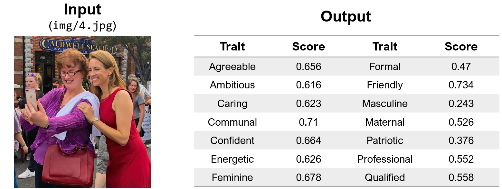
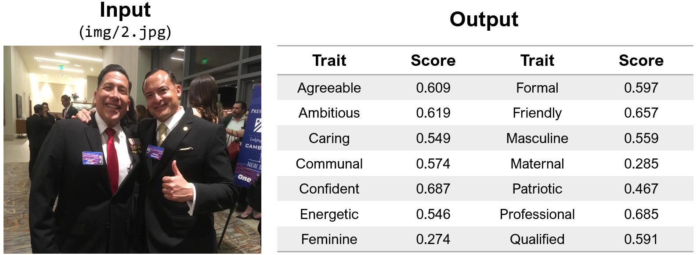

# Automatic Trait Inference of Election Photographs

This repository contains a checkpoint and card for a machine-learning model of inferring perceived gender traits from photographs of U.S. politicians.
The model and the following analyses were published through a paper at EPJ Data Science.





## Model description

- Input: Photos (of U.S. politicians)
- Output: 14 political traits (related to the election in literature)

- Model architecture: ResNet-34 with the 14-dimensional output layer

## How to use

Download [the model checkpoint](https://www.dropbox.com/scl/fi/0walps0zxexjdq6slirrd/model.pt?rlkey=nqvetm5ia8bfxbaquvp590yh2&dl=0) into the root directory of this repository.

```python
python infer.py --model_path model.pt --data_path sample_input.csv --result_path sample_output.csv img_dir sample_img
```

- data_path: a CSV file that has the 'path' column, which indicates the file path (without directory path)
- img_dir: directory path that contains image files

## How the model was trained

The model was trained on crowdworkers' perceptions of each of the 14 target traits.

## Performance

|Trait   | Performance |  Trait | Performance |
|---|---|---|---|
| Agreeable  | 0.436  | Formal       | 0.59  |
| Ambitious  | 0.374  | Friendly     | 0.496 |
|  Caring    | 0.442  | Masculine    | 0.492 |
| Communal   | 0.527  | Maternal     | 0.436 |
| Confident  | 0.422  | Patriotic    | 0.432 |
|  Energetic | 0.419  | Professional | 0.53  |
|  Feminine  | 0.535  | Qualified    | 0.39  |

Overall performance measured with Pearson's r measured against human perception values

## Potential Usage \& Limitation

This model can be used to infer visual traits for unlabeled U.S. election campaign images, which can be collected from social media. Or, users could apply this model to election images in any other context.
However, users should acknowledge its limitations and be cautious of its potential biases:

- The model was trained based on the perceived trait values of crowdworkers; it could reflect underlying biases.
- The training dataset was constructed from a single U.S. election; its performance could be unsatisfactory for other elections.
- Its prediction accuracy is unsatisfactory for several traits, such as Ambitious and Qualified.

## Reference

Please check [our paper](https://epjdatascience.springeropen.com/articles/10.1140/epjds/s13688-023-00404-7) published at EPJ Data Science for more detailed information.

```bibtex
@article{park2023finding,
  title={Perceived Masculinity from Facebook Photographs of Candidates Predicts Electoral Success},
  author={Kunwoo Park and Jungseock Joo},
  journal={EPJ Data Science},
  year={2023},
  publisher={Springer Berlin Heidelberg}
}
```
